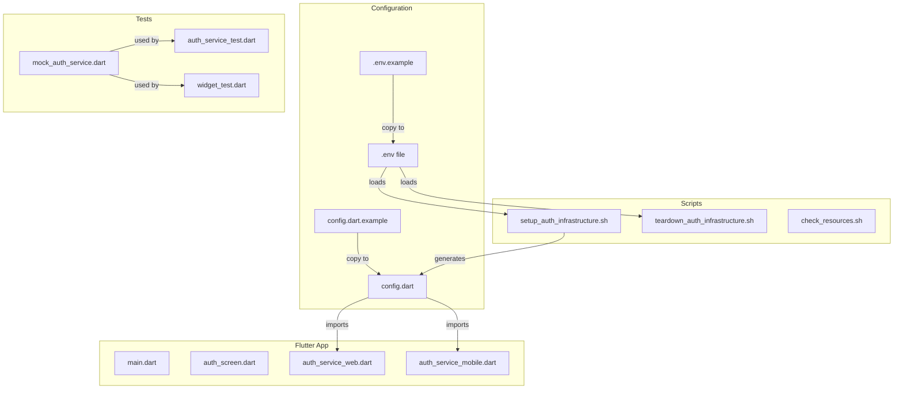

# Codebase Cleanup and Consolidation Plan

## Overview

This plan addresses the following objectives:
1. **Eliminate duplicate code** - Remove smaller scripts that duplicate functionality in the main setup script
2. **Protect sensitive values** - Create environment file system for configuration
3. **Ensure testing works** - Fix broken tests and add proper test coverage
4. **Check for errors and consistency** - Run static analysis and fix issues

---

## Current State Analysis

### Shell Scripts Inventory

| Script | Purpose | Status | Action |
|--------|---------|--------|--------|
| `setup_auth_infrastructure.sh` | Complete 15-step AWS setup | ✅ Keep | Refactor to use .env |
| `teardown_auth_infrastructure.sh` | Complete AWS teardown | ✅ Keep | Refactor to use .env |
| `check_resources.sh` | AWS resource inventory | ✅ Keep | No changes needed |
| `setup_api.sh` | Partial API setup | ❌ Duplicate | **DELETE** |
| `setup_pretokengen.sh` | Partial Lambda setup | ❌ Duplicate | **DELETE** |
| `fix_pretokengen.sh` | Lambda fix script | ❌ Duplicate | **DELETE** |

### Issues Identified

1. **Hardcoded Sensitive Values**
   - `setup_api.sh` lines 5-9: Contains AWS account ID, user pool ID, client ID
   - `setup_pretokengen.sh` lines 4-7: Contains AWS account ID, user pool ID
   - `fix_pretokengen.sh` lines 4-7: Contains AWS account ID, user pool ID
   - `lib/config.dart`: Contains Cognito domain, user pool ID, client ID, API endpoint

2. **Duplicate Functionality**
   - `setup_api.sh` duplicates Steps 5, 8-14 of `setup_auth_infrastructure.sh`
   - `setup_pretokengen.sh` duplicates Step 6 of `setup_auth_infrastructure.sh`
   - `fix_pretokengen.sh` is a subset of `setup_pretokengen.sh`

3. **Broken Tests**
   - `test/widget_test.dart` is the default Flutter counter test
   - Does not match actual app functionality
   - Will fail when run

4. **Missing .gitignore Entries**
   - `lib/config.dart` contains sensitive values but is tracked
   - No `.env` file protection

---

## Implementation Plan

### Phase 1: Delete Duplicate Scripts

**Files to Delete:**
- `setup_api.sh`
- `setup_pretokengen.sh`
- `fix_pretokengen.sh`

**Rationale:** These scripts contain hardcoded values specific to a previous deployment and their functionality is fully covered by `setup_auth_infrastructure.sh`.

---

### Phase 2: Create Environment Configuration System

**Create `.env.example`:**
```bash
# AWS Configuration
AWS_REGION=us-east-1
AWS_PROFILE=

# Google OAuth Configuration
# Get these from https://console.cloud.google.com/apis/credentials
GOOGLE_CLIENT_ID=your-google-client-id.apps.googleusercontent.com
GOOGLE_CLIENT_SECRET=your-google-client-secret

# App Configuration
APP_NAME=MyApp
COGNITO_DOMAIN_PREFIX=myapp-auth

# DynamoDB Configuration
DYNAMODB_TABLE_NAME=Users

# Callback URLs - JSON arrays
CALLBACK_URLS=["myapp://callback","http://localhost:8080/callback.html","http://localhost:8085/callback"]
LOGOUT_URLS=["myapp://signout","http://localhost:8080","http://localhost:8085"]
```

**Create `.env`:** Copy of `.env.example` with actual values - user fills this in locally.

---

### Phase 3: Update .gitignore

**Add entries:**
```gitignore
# Environment files with secrets
.env
.env.local
.env.*.local

# Generated config files
lib/config.dart
auth_config_output.json
flutter_config.dart

# Keep example files
!.env.example
!lib/config.dart.example
```

---

### Phase 4: Refactor Main Setup Script

**Modify `setup_auth_infrastructure.sh`:**

Replace hardcoded configuration section with:
```bash
# Load environment variables
if [ -f ".env" ]; then
  export $(grep -v '^#' .env | xargs)
else
  echo "ERROR: .env file not found. Copy .env.example to .env and fill in values."
  exit 1
fi

# Validate required variables
required_vars=("AWS_REGION" "GOOGLE_CLIENT_ID" "GOOGLE_CLIENT_SECRET" "APP_NAME")
for var in "${required_vars[@]}"; do
  if [ -z "${!var}" ]; then
    echo "ERROR: $var is not set in .env"
    exit 1
  fi
done
```

**Modify `teardown_auth_infrastructure.sh`:** Same pattern for loading .env.

---

### Phase 5: Create Flutter Config Template

**Create `lib/config.dart.example`:**
```dart
/// Authentication Configuration
///
/// Copy this file to config.dart and fill in your values.
/// DO NOT commit config.dart to source control.
class AuthConfig {
  // Cognito Configuration
  // Get these values from auth_config_output.json after running setup_auth_infrastructure.sh
  static const String cognitoDomain = 'YOUR_COGNITO_DOMAIN.auth.us-east-1.amazoncognito.com';
  static const String userPoolId = 'us-east-1_XXXXXXXXX';
  static const String clientId = 'XXXXXXXXXXXXXXXXXXXXXXXXXX';
  static const String apiEndpoint = 'https://XXXXXXXXXX.execute-api.us-east-1.amazonaws.com';

  // Redirect URIs - must match Cognito app client configuration
  static const String mobileRedirectUri = 'myapp://callback';
  static const String webRedirectUri = 'http://localhost:8080/callback.html';
  static const String desktopRedirectUri = 'http://localhost:8085/callback';

  static const String mobileLogoutUri = 'myapp://signout';
  static const String webLogoutUri = 'http://localhost:8080';

  // OAuth Scopes
  static const List<String> scopes = ['openid', 'email', 'profile'];
}
```

---

### Phase 6: Add config.dart to .gitignore

This is covered in Phase 3. The current `lib/config.dart` will need to be:
1. Copied to `lib/config.dart.example` as template
2. Removed from git tracking: `git rm --cached lib/config.dart`
3. Added to `.gitignore`

---

### Phase 7: Run Flutter Analyzer

**Commands to run:**
```bash
flutter analyze
dart fix --apply
```

**Expected issues to address:**
- Import statement in `test/widget_test.dart` references `auth_test` but package is `auth_demo`
- Any linting warnings from `analysis_options.yaml`

---

### Phase 8: Write Unit Tests for Auth Service

**Create `test/services/auth_service_test.dart`:**

Test coverage for:
- `AuthServiceInterface` contract verification
- Token storage/retrieval mocking
- URL building logic
- Error handling scenarios

**Create `test/mocks/mock_auth_service.dart`:**

Mock implementation for testing UI components.

---

### Phase 9: Write Widget Tests for Auth Screen

**Update `test/widget_test.dart`:**

Test coverage for:
- Unauthenticated view renders correctly
- Authenticated view renders correctly
- Sign in button triggers auth flow
- Sign out button clears state
- Error messages display properly
- Loading states work correctly

---

### Phase 10: Update README

**Updates needed:**
1. Add setup instructions for `.env` file
2. Remove references to deleted scripts
3. Add testing instructions
4. Update project structure diagram
5. Add troubleshooting for common `.env` issues

---

### Phase 11: Final Verification

**Checklist:**
- [ ] All duplicate scripts deleted
- [ ] `.env.example` created with all required variables
- [ ] `.gitignore` updated with sensitive file patterns
- [ ] `setup_auth_infrastructure.sh` loads from `.env`
- [ ] `teardown_auth_infrastructure.sh` loads from `.env`
- [ ] `lib/config.dart.example` created
- [ ] `lib/config.dart` removed from git tracking
- [ ] `flutter analyze` passes with no errors
- [ ] All tests pass: `flutter test`
- [ ] README updated with new instructions

---

## File Changes Summary

### Files to Delete
- `setup_api.sh`
- `setup_pretokengen.sh`
- `fix_pretokengen.sh`

### Files to Create
- `.env.example`
- `lib/config.dart.example`
- `test/services/auth_service_test.dart`
- `test/mocks/mock_auth_service.dart`

### Files to Modify
- `.gitignore` - Add sensitive file patterns
- `setup_auth_infrastructure.sh` - Load config from .env
- `teardown_auth_infrastructure.sh` - Load config from .env
- `test/widget_test.dart` - Replace with actual app tests
- `README.md` - Update setup instructions

### Files to Remove from Git Tracking
- `lib/config.dart` - Keep locally, remove from repo

---

## Architecture Diagram



---

## Risk Assessment

| Risk | Impact | Mitigation |
|------|--------|------------|
| Existing config.dart has real values | Medium | Backup before removing from git |
| Tests may require mocking HTTP calls | Low | Use mockito or http_mock_adapter |
| .env not created before running scripts | High | Add clear error message and validation |

---

## Next Steps

After this plan is approved, switch to **Code mode** to implement the changes in the following order:

1. Delete duplicate scripts
2. Create `.env.example` and update `.gitignore`
3. Refactor shell scripts to use `.env`
4. Create `config.dart.example` and update git tracking
5. Fix Flutter analyzer issues
6. Write tests
7. Update README
